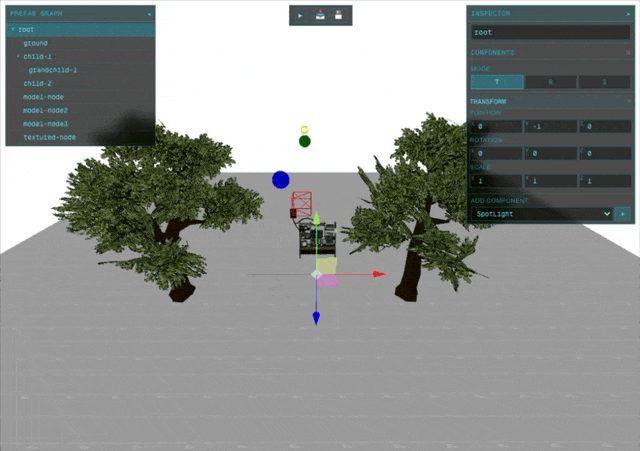
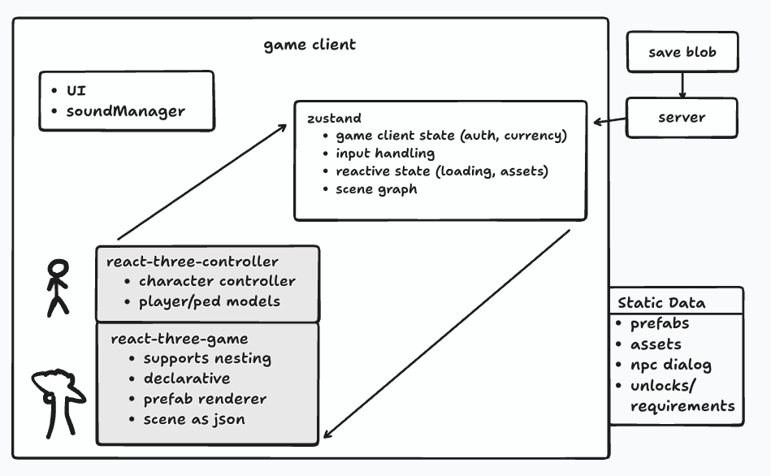

# react-three-game

JSON-first 3D game engine. React Three Fiber + WebGPU + Rapier Physics.

```bash
npm i react-three-game @react-three/fiber @react-three/rapier three
```




## Usage

```jsx
import { Physics } from '@react-three/rapier';
import { GameCanvas, PrefabRoot } from 'react-three-game';

<GameCanvas>
  <Physics>
    <PrefabRoot data={{
      root: {
        id: "scene",
        children: [
          {
            id: "ground",
            components: {
              transform: { type: "Transform", properties: { position: [0, 0, 0], rotation: [-1.57, 0, 0] } },
              geometry: { type: "Geometry", properties: { geometryType: "plane", args: [50, 50] } },
              material: { type: "Material", properties: { color: "#3a3" } },
              physics: { type: "Physics", properties: { type: "fixed" } }
            }
          },
          {
            id: "ball",
            components: {
              transform: { type: "Transform", properties: { position: [0, 5, 0] } },
              geometry: { type: "Geometry", properties: { geometryType: "sphere" } },
              material: { type: "Material", properties: { color: "#f66" } },
              physics: { type: "Physics", properties: { type: "dynamic" } }
            }
          }
        ]
      }
    }} />
  </Physics>
</GameCanvas>
```

## GameObject Schema

```typescript
interface GameObject {
  id: string;
  disabled?: boolean;
  hidden?: boolean;
  components?: Record<string, { type: string; properties: any }>;
  children?: GameObject[];
}
```

## Built-in Components

| Component | Key Properties |
|-----------|----------------|
| Transform | `position`, `rotation`, `scale` — all `[x,y,z]` arrays, rotation in radians |
| Geometry | `geometryType`: box/sphere/plane/cylinder, `args`: dimension array |
| Material | `color`, `texture?`, `metalness?`, `roughness?` |
| Physics | `type`: dynamic/fixed |
| Model | `filename` (GLB/FBX path), `instanced?` for GPU batching |
| SpotLight | `color`, `intensity`, `angle`, `penumbra` |

## Custom Components

```tsx
import { Component, registerComponent, FieldRenderer, FieldDefinition } from 'react-three-game';
import { useFrame } from '@react-three/fiber';

const rotatorFields: FieldDefinition[] = [
  { name: 'speed', type: 'number', label: 'Speed', step: 0.1 },
  { name: 'axis', type: 'select', label: 'Axis', options: [
    { value: 'x', label: 'X' },
    { value: 'y', label: 'Y' },
    { value: 'z', label: 'Z' },
  ]},
];

const Rotator: Component = {
  name: 'Rotator',
  Editor: ({ component, onUpdate }) => (
    <FieldRenderer fields={rotatorFields} values={component.properties} onChange={onUpdate} />
  ),
  View: ({ properties, children }) => {
    const ref = useRef<Group>(null);
    useFrame((_, dt) => { ref.current!.rotation.y += dt * properties.speed });
    return <group ref={ref}>{children}</group>;
  },
  defaultProperties: { speed: 1, axis: 'y' }
};

registerComponent(Rotator); // before rendering PrefabEditor
```

**Wrapper** components accept `children` (animations, controllers). **Leaf** components don't (lights, particles).

### Schema-Driven Field Types

The `FieldRenderer` component auto-generates editor UI from a field schema:

| Type | Description | Options |
|------|-------------|---------|
| `vector3` | X/Y/Z inputs with drag-to-scrub | `snap?: number` |
| `number` | Numeric input | `min?`, `max?`, `step?` |
| `string` | Text input | `placeholder?` |
| `color` | Color picker + hex input | — |
| `boolean` | Checkbox | — |
| `select` | Dropdown | `options: { value, label }[]` |
| `custom` | Render function for one-off UI | `render: (props) => ReactNode` |

```tsx
// Custom field example for complex one-off UI
{
  name: 'gradient',
  type: 'custom',
  label: 'Gradient',
  render: ({ value, onChange, values, onChangeMultiple }) => (
    <GradientPicker value={value} onChange={onChange} />
  ),
}
```

## Visual Editor

```jsx
import { PrefabEditor } from 'react-three-game';
<PrefabEditor initialPrefab={sceneData} onPrefabChange={setSceneData} />
```

Keys: **T**ranslate / **R**otate / **S**cale. Drag tree nodes to reparent. Import/export JSON.

## Internals

- **Transforms**: Local in JSON, world computed via matrix multiplication
- **Instancing**: `model.properties.instanced = true` → `<Merged>` + `<InstancedRigidBodies>`
- **Models**: GLB/GLTF (Draco) and FBX auto-load from `filename`

## Tree Utilities

```typescript
import { findNode, updateNode, deleteNode, cloneNode } from 'react-three-game';

const updated = updateNode(root, nodeId, n => ({ ...n, disabled: true }));
```

## Development

```bash
npm run dev     # tsc --watch + docs site (localhost:3000)
npm run build   # → /dist
npm run release # build + publish
```

```
/src                 → library (published)
/docs                → Next.js demo site
```

---

React 19 · Three.js WebGPU · TypeScript 5 · Rapier WASM · MIT License

## Manifest generation script

A small helper script is included to auto-generate asset manifests from the `public` folder. See `docs/generate-manifests.sh`.

- **What it does:**
  Searches `public/models` for `.glb`/`.fbx`, `public/textures` for `.jpg`/`.png`, and `public/sound` for `.mp3`/`.wav`, then writes JSON arrays to:
  - `public/models/manifest.json`
  - `public/textures/manifest.json`
  - `public/sound/manifest.json`
  
  These manifest files are used to populate the Asset Viewer in the Editor.

- **How to run:**

  1. Make it executable (once):

     ```sh
     chmod +x docs/generate-manifests.sh
     ```

  2. Run the script from the repo root (zsh/bash):

     ```sh
     ./docs/generate-manifests.sh
     ```


The script is intentionally simple and portable (uses `find`/`sed`).
If you need different file types or output formatting, edit `docs/generate-manifests.sh`.
