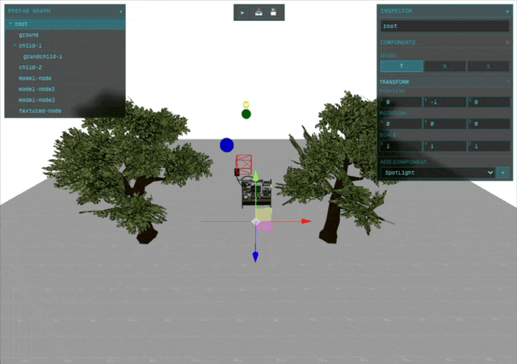
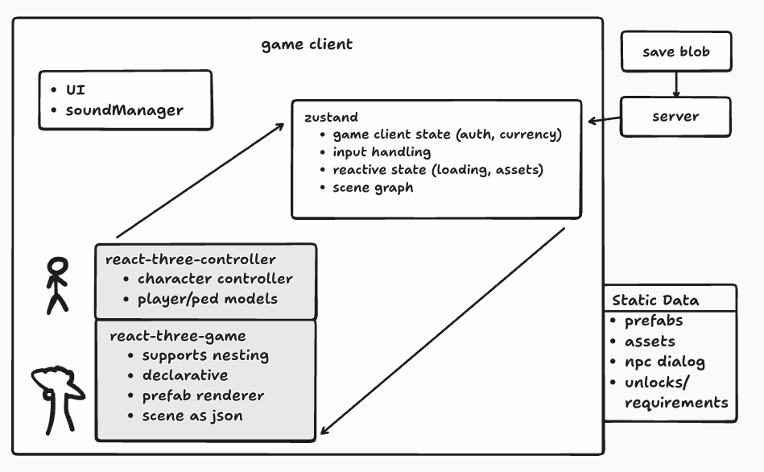

# react-three-game

JSON-first 3D game engine. React Three Fiber + WebGPU + Rapier Physics.

```bash
npm i react-three-game @react-three/fiber @react-three/rapier three
```




## Agent Skill
```bash
npx skills add https://github.com/prnthh/react-three-game-skill
```

## Usage Modes

**PrefabRoot**: Pure renderer for embedding prefab data in standard R3F applications. Render it inside a regular `@react-three/fiber` `Canvas`. `GameCanvas` provides the WebGPU canvas setup. Add a `Physics` wrapper to enable physics. Use this to integrate prefabs into larger R3F scenes.

**PrefabEditor**: Managed scene with editor UI and play/pause controls for physics. Full authoring tool for level design and prototyping. Includes canvas, physics, transform gizmos, and inspector. Physics only runs in play mode. Can pass R3F components as children.

## Basic Usage

```jsx
import { Physics } from "@react-three/rapier";
import { GameCanvas, PrefabRoot } from "react-three-game";

const sceneData = {
  root: {
    id: "scene",
    children: [
      {
        id: "ground",
        components: {
          transform: { type: "Transform", properties: { position: [0, 0, 0], rotation: [-1.57, 0, 0] } },
          geometry: { type: "Geometry", properties: { geometryType: "plane", args: [50, 50] } },
          material: { type: "Material", properties: { color: "#3a3" } },
          physics: { type: "Physics", properties: { type: "fixed" } }
        }
      },
      {
        id: "ball",
        components: {
          transform: { type: "Transform", properties: { position: [0, 5, 0] } },
          geometry: { type: "Geometry", properties: { geometryType: "sphere" } },
          material: { type: "Material", properties: { color: "#f66" } },
          physics: { type: "Physics", properties: { type: "dynamic" } }
        }
      }
    ]
  }
};

export default function Home() {
  return (
    <main className="flex h-screen w-screen">
      <GameCanvas>
        <Physics>
          <ambientLight intensity={0.8} />
          <PrefabRoot data={sceneData} />
        </Physics>
      </GameCanvas>
    </main>
  );
}
```

`GameCanvas` provides the library's WebGPU canvas setup.

## GameObject Schema

```typescript
interface Prefab {
  id?: string;
  name?: string;
  root: GameObject;
}

interface GameObject {
  id: string;
  name?: string;
  disabled?: boolean;
  components?: Record<string, { type: string; properties: any }>;
  children?: GameObject[];
}
```

`disabled` is the canonical visibility toggle in the current schema. Transforms are local to the parent node.

## Built-in Components

| Component | Key Properties |
|-----------|----------------|
| Transform | `position`, `rotation`, `scale` — all `[x,y,z]` arrays, rotation in radians |
| Geometry | `geometryType`: box/sphere/plane/cylinder, `args`: dimension array |
| Material | `color`, `texture?`, `metalness?`, `roughness?` |
| Physics | `type`: dynamic/fixed/kinematicPosition/kinematicVelocity, `mass?`, `restitution?` (bounciness), `friction?`, plus any Rapier props |
| Model | `filename` (GLB/FBX path), `instanced?` for GPU batching |
| SpotLight | `color`, `intensity`, `angle`, `penumbra` |

## Custom Components

```tsx
import { Component, registerComponent, FieldRenderer, FieldDefinition } from 'react-three-game';
import { useFrame } from '@react-three/fiber';

const rotatorFields: FieldDefinition[] = [
  { name: 'speed', type: 'number', label: 'Speed', step: 0.1 },
  { name: 'axis', type: 'select', label: 'Axis', options: [
    { value: 'x', label: 'X' },
    { value: 'y', label: 'Y' },
    { value: 'z', label: 'Z' },
  ]},
];

const Rotator: Component = {
  name: 'Rotator',
  Editor: ({ component, onUpdate }) => (
    <FieldRenderer fields={rotatorFields} values={component.properties} onChange={onUpdate} />
  ),
  View: ({ properties, children }) => {
    const ref = useRef<Group>(null);
    useFrame((_, dt) => { ref.current!.rotation.y += dt * properties.speed });
    return <group ref={ref}>{children}</group>;
  },
  defaultProperties: { speed: 1, axis: 'y' }
};

registerComponent(Rotator); // before rendering PrefabEditor
```

Components may render visible content, wrap child content, or contribute runtime behavior. Keep those semantics explicit in the component `View` rather than relying on hidden tree rules.

### Schema-Driven Field Types

The `FieldRenderer` component auto-generates editor UI from a field schema:

| Type | Description | Options |
|------|-------------|---------|
| `vector3` | X/Y/Z inputs with drag-to-scrub | `snap?: number` |
| `number` | Numeric input | `min?`, `max?`, `step?` |
| `string` | Text input | `placeholder?` |
| `color` | Color picker + hex input | — |
| `boolean` | Checkbox | — |
| `select` | Dropdown | `options: { value, label }[]` |
| `custom` | Render function for one-off UI | `render: (props) => ReactNode` |

```tsx
// Custom field example for complex one-off UI
{
  name: 'gradient',
  type: 'custom',
  label: 'Gradient',
  render: ({ value, onChange, values, onChangeMultiple }) => (
    <GradientPicker value={value} onChange={onChange} />
  ),
}
```

## Prefab Editor

```jsx
import { useRef } from 'react';
import { PrefabEditor } from 'react-three-game';

// Standalone editor
<PrefabEditor initialPrefab={sceneData} onPrefabChange={setSceneData} />

// Canvas-only editing mode (keeps canvas selection/gizmos, hides hierarchy + inspector + toolbar)
<PrefabEditor initialPrefab={sceneData} showUI={false} />

// With custom R3F components
<PrefabEditor initialPrefab={sceneData}>
  <CustomComponent />
</PrefabEditor>
```

### Embedded / Headless Editor

```tsx
import { useRef } from 'react';
import type { Object3D } from 'three';
import { PrefabEditor, type PrefabEditorRef } from 'react-three-game';

export function EmbeddedEditor({ prefab, onPrefabChange }: {
  prefab: any;
  onPrefabChange: (nextPrefab: any) => void;
}) {
  const editorRef = useRef<PrefabEditorRef>(null);

  function loadScene(nextPrefab: any) {
    editorRef.current?.replacePrefab(nextPrefab);
  }

  function importRuntimeModel(model: Object3D) {
    editorRef.current?.addModel('models/runtime/chair.glb', model, {
      name: 'Chair',
      parentId: 'root',
    });
  }

  return (
    <div style={{ position: 'relative', height: 600 }}>
      <div style={{ position: 'absolute', top: 12, left: 12, zIndex: 10 }}>
        <button onClick={() => loadScene(prefab)}>Reload Scene</button>
        <button onClick={() => editorRef.current?.exportGLBData()}>Export GLB Data</button>
      </div>

      <PrefabEditor
        ref={editorRef}
        initialPrefab={prefab}
        onPrefabChange={onPrefabChange}
        showUI={false}
        physics={false}
        enableWindowDrop={false}
      />
    </div>
  );
}
```

`showUI={false}` hides the built-in editor chrome but keeps canvas selection, transform controls, and scene interaction. For embedded tools, use the editor ref instead of reaching through `rootRef`:

- `replacePrefab(prefab)` replaces the current scene through the editor state pipeline and resets editor history/selection.
- `addModel(path, model, options?)` creates a model node and injects the runtime asset in one step.
- `addTexture(path, texture, options?)` creates a textured plane node and injects the runtime texture in one step.
- `exportGLBData()` returns the GLB `ArrayBuffer` without triggering a download.
- `setPrefab(prefab)` remains as a backward-compatible alias for `replacePrefab(prefab)`.

Keys: **T**ranslate / **R**otate / **S**cale. Drag tree nodes to reparent. Physics only runs in play mode.

Editor menu structure:
- `Menu > File`: new scene, load/save prefab JSON, load prefab into scene
- `Menu > Export`: `GLB`, `PNG`

## Internals

- **Transforms**: Local in JSON, world computed via matrix multiplication
- **Instancing**: `model.properties.instanced = true` switches the node to the batched instance path (`<Merged>` / `<InstancedRigidBodies>`) instead of the standard model render path
- **Models**: GLB/GLTF (Draco) and FBX auto-load from `filename`

## Tree Utilities

```typescript
import { findNode, updateNode, updateNodeById, deleteNode, cloneNode, exportGLBData } from 'react-three-game';

const node = findNode(root, nodeId);
const updated = updateNode(root, nodeId, n => ({ ...n, disabled: true }));  // or updateNodeById
const afterDelete = deleteNode(root, nodeId);
const cloned = cloneNode(node);
const glbData = await exportGLBData(sceneRoot);  // export scene to GLB ArrayBuffer
```

## Development

```bash
npm run dev     # tsc --watch + docs site (localhost:3000)
npm run build   # → /dist
npm run release # build + publish
```

```
/src                 → library (published)
/docs                → Next.js demo site
```

---

React 19 · Three.js WebGPU · TypeScript 5 · Rapier WASM · MIT License

## Manifest generation script

A small helper script is included to auto-generate asset manifests from the `public` folder. See `docs/generate-manifests.sh`.

- **What it does:**
  Searches `public/models` for `.glb`/`.fbx`, `public/textures` for `.jpg`/`.png`, and `public/sound` for `.mp3`/`.wav`, then writes JSON arrays to:
  - `public/models/manifest.json`
  - `public/textures/manifest.json`
  - `public/sound/manifest.json`
  
  These manifest files are used to populate the Asset Viewer in the Editor.

- **How to run:**

  1. Make it executable (once):

     ```sh
     chmod +x docs/generate-manifests.sh
     ```

  2. Run the script from the repo root (zsh/bash):

     ```sh
     ./docs/generate-manifests.sh
     ```


The script is intentionally simple and portable (uses `find`/`sed`).
If you need different file types or output formatting, edit `docs/generate-manifests.sh`.
