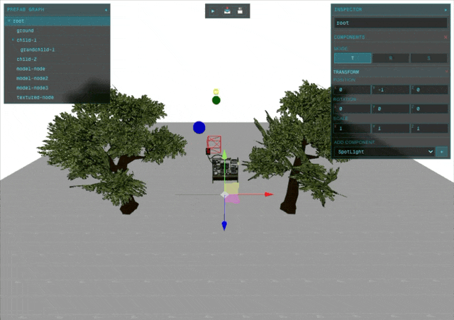

# react-three-game



Serializable prefab documents for React Three Fiber scenes and games.

Built with [three.js](https://github.com/mrdoob/three.js), [React Three Fiber](https://github.com/pmndrs/react-three-fiber), and [Drei](https://github.com/pmndrs/drei).

- Website: https://prnth.com/react-three-game
- Editor: https://prnth.com/react-three-game/editor
- Starter: https://github.com/prnthh/react-three-game-starter

## The model

React Three Game has four scopes:

| Scope | Purpose | API |
|---|---|---|
| Scene | The outer R3F scene and Edit/Play mode | `useScene()` |
| Prefab | One serializable document with local nodes and shared materials | `usePrefab()` |
| Node | One entity in a prefab | `useNode()`, `useNodeObject()` |
| Component | A reusable rendering or gameplay capability | `registerComponent()` |

A scene can compose many prefab documents. Child prefabs share the outer scene while keeping their node ids, materials, and mutations local to their document.

## Install

```bash
npm install react-three-game @react-three/drei @react-three/fiber three
```

Crashcat physics is available from the optional plugin entrypoint:

```bash
npm install crashcat
```

## 1. Describe a prefab

A prefab stores materials once and composes entities from component data.

```tsx
import type { Prefab } from "react-three-game";

export const starterPrefab: Prefab = {
  id: "starter",
  name: "Starter Scene",
  materials: {
    ground: {
      name: "Ground",
      materialType: "standard",
      color: "#5b7f46",
      roughness: 1,
    },
    ball: {
      name: "Ball",
      materialType: "standard",
      color: "#f97316",
      roughness: 0.45,
      metalness: 0.1,
    },
  },
  root: {
    id: "root",
    children: [
      {
        id: "camera",
        components: {
          transform: {
            type: "Transform",
            properties: {
              position: [0, 4, 9],
              rotation: [-0.3, 0, 0],
              scale: [1, 1, 1],
            },
          },
          camera: {
            type: "Camera",
            properties: { projection: "perspective", fov: 50 },
          },
        },
      },
      {
        id: "ground",
        components: {
          transform: {
            type: "Transform",
            properties: {
              position: [0, 0, 0],
              rotation: [-Math.PI / 2, 0, 0],
              scale: [1, 1, 1],
            },
          },
          mesh: {
            type: "Mesh",
            properties: { receiveShadow: true },
          },
          geometry: {
            type: "Geometry",
            properties: { geometryType: "plane", args: [30, 30] },
          },
          material: {
            type: "Material",
            properties: { materialId: "ground" },
          },
        },
      },
      {
        id: "ball",
        components: {
          transform: {
            type: "Transform",
            properties: {
              position: [0, 1, 0],
              rotation: [0, 0, 0],
              scale: [1, 1, 1],
            },
          },
          mesh: {
            type: "Mesh",
            properties: { castShadow: true, receiveShadow: true },
          },
          geometry: {
            type: "Geometry",
            properties: { geometryType: "sphere", args: [1, 32, 16] },
          },
          material: {
            type: "Material",
            properties: { materialId: "ball" },
          },
        },
      },
    ],
  },
};
```

## 2. Mount the scene

`GameCanvas` supplies the WebGPU R3F canvas. `PrefabRoot` mounts the document.

```tsx
import { GameCanvas, PrefabRoot } from "react-three-game";
import { starterPrefab } from "./starterPrefab";

export default function App() {
  return (
    <GameCanvas>
      <ambientLight intensity={0.8} />
      <PrefabRoot data={starterPrefab} />
    </GameCanvas>
  );
}
```

Passing a new `data` object loads that prefab. Runtime children can be composed inside `PrefabRoot`:

```tsx
<PrefabRoot data={starterPrefab}>
  <GameRuntime />
</PrefabRoot>
```

## 3. Understand component composition

Components compose using the same parent-child model as R3F:

```tsx
<mesh>
  <boxGeometry attach="geometry" />
  <meshStandardMaterial attach="material" />
  {children}
</mesh>
```

| Role | Built-ins | Result |
|---|---|---|
| Transform | `Transform` | Outer node position, rotation, and scale |
| Object | `Mesh`, `Model`, `Sprite`, `Text`, lights, `Camera` | Three.js object for the entity |
| Attachment | `Geometry`, `BufferGeometry`, `Material` | Geometry and material attachment |
| Wrapper | `Sound`, `Data`, `PrefabRef`, custom components | Behavior around the composed subtree |

`Material` selects a definition from `Prefab.materials` by `materialId`. Every entity using the same id receives the same native material. Updating that material updates every user.

`BufferGeometry` accepts flat numeric `positions`, `indices`, `normals`, and `uvs` arrays for procedural authored meshes.

## 4. Add the optional editor

The editor lives in its own entrypoint for optional loading and code splitting.

```tsx
import { PrefabEditor } from "react-three-game/editor";
import { starterPrefab } from "./starterPrefab";

export default function Authoring() {
  return <PrefabEditor prefab={starterPrefab} />;
}
```

`prefab` is the document input. Passing a new value reloads the editor. Internal edits remain active in the editor and `ref.save()` returns the current document.

```tsx
import { useRef } from "react";
import {
  PrefabEditor,
  type PrefabEditorRef,
} from "react-three-game/editor";

function Authoring() {
  const editorRef = useRef<PrefabEditorRef>(null);

  return (
    <>
      <button onClick={() => console.log(editorRef.current?.save())}>Save</button>
      <PrefabEditor ref={editorRef} prefab={starterPrefab} />
    </>
  );
}
```

Camera nodes become active in Play mode. Edit mode shows camera wireframes and gives camera control to the editor.

## 5. Use runtime APIs

`useScene` describes the shared scene. `usePrefab` accesses the current prefab document.

```tsx
import { useFrame } from "@react-three/fiber";
import {
  PrefabEditorMode,
  usePrefab,
  useScene,
} from "react-three-game";

function GameRuntime() {
  const scene = useScene();
  const prefab = usePrefab();

  useFrame((_, delta) => {
    if (scene.mode !== PrefabEditorMode.Play) return;
    const ball = prefab.getObject("ball");
    if (ball) ball.rotation.y += delta;
  });

  return null;
}
```

| Hook | Scope |
|---|---|
| `useScene()` | Shared `root` and `mode` |
| `usePrefab()` | Current document, live node registry, materials, assets, mutations |
| `useNode()` | Current component node id, mode, selection, interaction handlers |
| `useNodeObject<T>()` | Live ref for the current node object |
| `useNodeHandle<T>(kind)` | Live ref for a current-node capability |
| `useAssetRuntime()` | Shared loaded model, texture, and sound cache |

Prefab document operations:

```ts
prefab.get(id);
prefab.getObject(id);
prefab.getHandle(id, kind);
prefab.getModel(path);
prefab.getMaterial(materialId);

prefab.add(node, parentId);
prefab.update(id, node => nextNode);
prefab.setMaterial(materialId, material);
prefab.replaceNode(id, node);
prefab.remove(id);
prefab.duplicate(id);
prefab.move(id, targetId, "inside");
prefab.replace(nextPrefab);
```

Prefab mutations represent authored changes. Native `Object3D` mutation represents animation and simulation state.

## 6. Register a custom component

```tsx
import { useFrame } from "@react-three/fiber";
import {
  registerComponent,
  useNode,
  useNodeObject,
  type Component,
  type ComponentViewProps,
} from "react-three-game";
import {
  FieldRenderer,
  type ComponentEditorProps,
  type FieldDefinition,
} from "react-three-game/editor";

type RotatorProperties = {
  speed?: number;
  axis?: "x" | "y" | "z";
};

const fields = [
  { name: "speed", type: "number", label: "Speed", step: 0.1 },
  {
    name: "axis",
    type: "select",
    label: "Axis",
    options: [
      { value: "x", label: "X" },
      { value: "y", label: "Y" },
      { value: "z", label: "Z" },
    ],
  },
] satisfies FieldDefinition<RotatorProperties>[];

function RotatorEditor({ properties, update }: ComponentEditorProps<RotatorProperties>) {
  return <FieldRenderer fields={fields} values={properties} onChange={update} />;
}

function RotatorView({ properties, children }: ComponentViewProps<RotatorProperties>) {
  const { editMode } = useNode();
  const objectRef = useNodeObject();

  useFrame((_, delta) => {
    const object = objectRef.current;
    if (editMode || !object) return;
    object.rotation[properties.axis ?? "y"] += delta * (properties.speed ?? 1);
  });

  return <>{children}</>;
}

const Rotator: Component<RotatorProperties> = {
  name: "Rotator",
  Editor: RotatorEditor,
  View: RotatorView,
  defaultProperties: { speed: 1, axis: "y" },
};

registerComponent(Rotator);
```

Use it in any prefab node:

```json
{
  "rotator": {
    "type": "Rotator",
    "properties": { "speed": 1.5, "axis": "y" }
  }
}
```

## 7. Compose prefab documents

`PrefabRef` loads a reusable document inside the current scene:

```json
{
  "id": "room-instance",
  "components": {
    "prefab": {
      "type": "PrefabRef",
      "properties": { "url": "/prefabs/room.json" }
    }
  }
}
```

The child document receives the parent scene mode and its own `usePrefab()` scope.

## 8. Add pointer events and plugins

Pointer-enabled object component:

```json
{
  "mesh": {
    "type": "Mesh",
    "properties": {
      "emitClickEvent": true,
      "clickEventName": "crate:click"
    }
  }
}
```

```tsx
<PrefabRoot
  data={starterPrefab}
  onPointerEvent={(eventType, event, node) => {
    if (eventType === "click") selectNode(node.id, event.point);
  }}
/>
```

Crashcat physics stays in its plugin entrypoint:

```tsx
import { registerComponent } from "react-three-game";
import {
  CrashcatPhysicsComponent,
  CrashcatRuntime,
} from "react-three-game/plugins/crashcat";

registerComponent(CrashcatPhysicsComponent);

<PrefabRoot data={physicsPrefab}>
  <CrashcatRuntime />
</PrefabRoot>
```

## Package exports

| Entry | Purpose |
|---|---|
| `react-three-game` | Runtime renderer, scene/prefab APIs, component registry, events, assets, types |
| `react-three-game/editor` | Optional editor, fields, editor state, authoring utilities, asset viewers |
| `react-three-game/plugins/crashcat` | Optional Crashcat integration |

## Development

```bash
npm run dev
npm run build
npm run release
```

## License

PFYL / VPL
